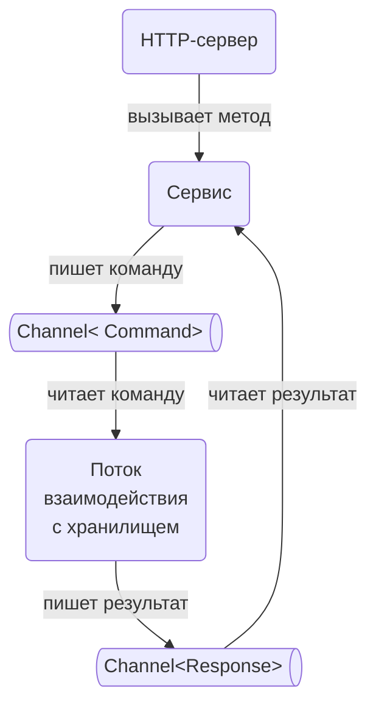
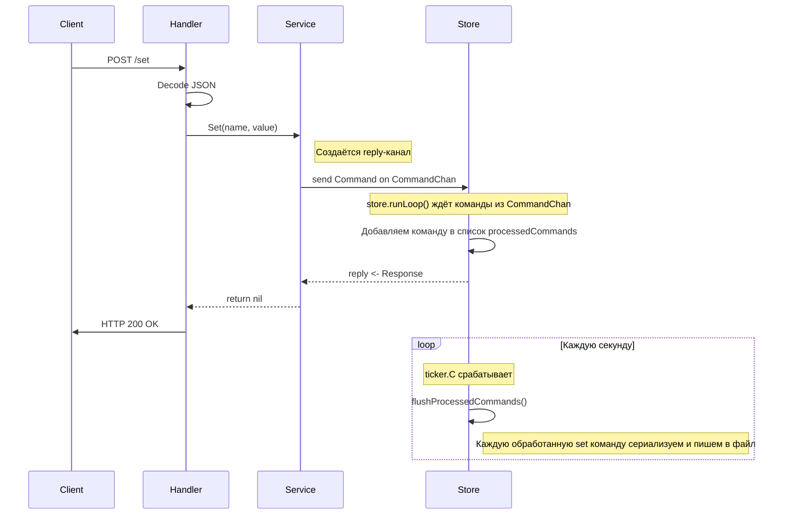

```mermaid
graph TB;
    A(HTTP-сервер)
    B[Channel&lt; Command&gt;]
    C[Channel&lt;Response&gt;]
    D(Поток<br>взаимодействия<br>с хранилищем)
    B@{ shape: das}
    C@{ shape: das}

    E(Сервис)

    A --> |вызывает метод| E
    D --> |пишет результат| C
    E --> |пишет команду| B
    B --> |читает команду| D
    C --> |читает результат| E
```

```mermaid
sequenceDiagram
    participant Client
    participant Handler
    participant Service
    participant Store

    Client->>Handler: POST /set
    Handler->>Handler: Decode JSON

    Handler->>Service: Set(name, value)
    note right of Service: Создаётся reply-канал
    Service->>Store: send Command on CommandChan

    note over Store: store.runLoop() ждёт команды из CommandChan
    Store->>Store: Добавляем команду в список processedCommands
    Store-->>Service: reply <- Response

    Service-->>Handler: return nil

    Handler->>Client: HTTP 200 OK

    loop Каждую секунду
        note over Store: ticker.C срабатывает
        Store->>Store: flushProcessedCommands()
        note right of Store: Каждую обработанную set команду сериализуем и пишем в файл
    end
```